<!--
  Edit the SYSTEM.INFO panel in assets/profile.json (the "lines" array), then run
  `python scripts/generate.py` or merge so the "Refresh profile assets" workflow
  redraws assets/header.svg.

  Socials other than GitHub are off. Search for YOUR_LINKEDIN and YOUR_INSTAGRAM
  below, put the real URLs in, and uncomment those blocks. Optional matching
  lines (they are not drawn today) live in profile.json under
  _placeholders_not_rendered: Origin, Grid.LinkedIn, Grid.Instagram.

  Location is intentionally blank. Add it in the About section when you want
  it public.
-->


 


 

 

<!--
  LinkedIn — set your URL, then uncomment this block.
  
-->

<!--
  Instagram — set your URL, then uncomment this block.
  
-->

 

---

## About

Hi, I'm **Drini**. I build front-end interfaces with TypeScript, React, Vite, and Tailwind, and I keep the work in public repos.

- Most of my commits are on **[Logistic-Company](https://github.com/DriniNazeraj/Logistic-Company)**, a TanStack Start app for cargos, warehouses, and package tracking (Transport Square, USA to Albania).
- **[prive-travel](https://github.com/DriniNazeraj/prive-travel)** is a bilingual React site, English and Albanian, for Privé Travel: itineraries, consulting, and mentoring pages.
- **[Scraper-GYG-TripAdvisor](https://github.com/DriniNazeraj/Scraper-GYG-TripAdvisor)** is a Python scraper that searches GetYourGuide and TripAdvisor together.
- A cluster of **C** repos uses Common Core names: [Libft](https://github.com/DriniNazeraj/Common-Core---Libft), [Printf](https://github.com/DriniNazeraj/Common-Core---Printf), [GetNextLine](https://github.com/DriniNazeraj/Common-Core---GetNextLine), and [Push_Swap](https://github.com/DriniNazeraj/Common-Core---Push_Swap).
- **[whatsApp-comment](https://github.com/DriniNazeraj/whatsApp-comment)** is a NestJS WhatsApp API gateway based on OpenWA, with a React dashboard.

The only social link on this page is GitHub: [@DriniNazeraj](https://github.com/DriniNazeraj).

---

## Stack

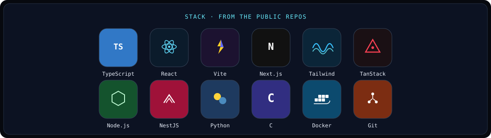

---

## Signals

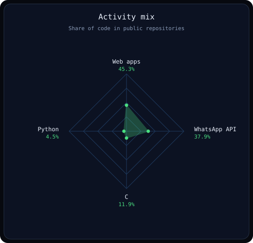
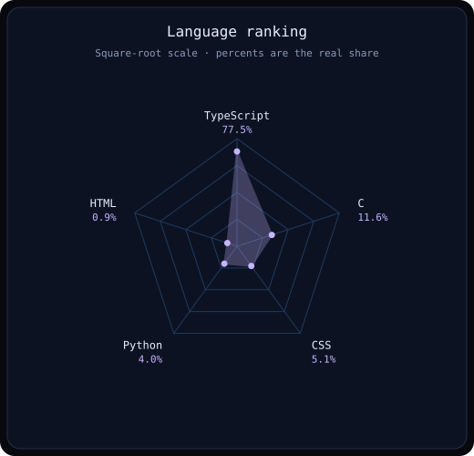

---

## By the numbers

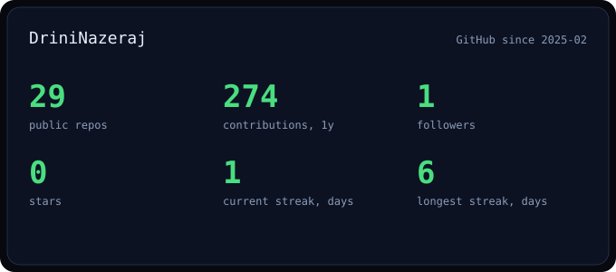
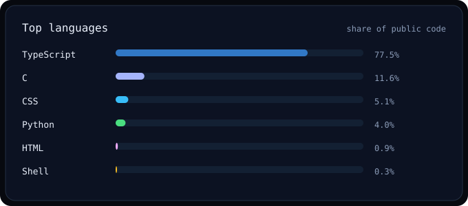

---

## Featured projects

<a href="https://github.com/DriniNazeraj/Logistic-Company">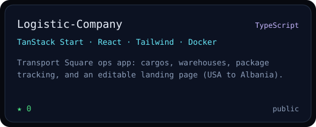</a>
<a href="https://github.com/DriniNazeraj/prive-travel">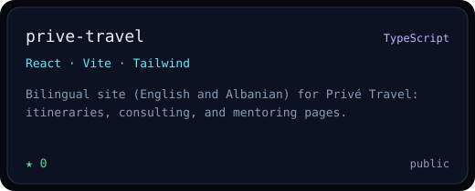</a>

<a href="https://github.com/DriniNazeraj/Scraper-GYG-TripAdvisor">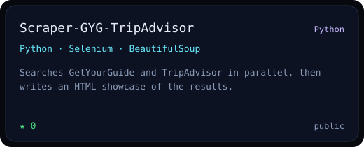</a>
<a href="https://github.com/DriniNazeraj/Common-Core---Push_Swap">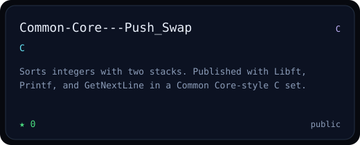</a>

<a href="https://github.com/DriniNazeraj/whatsApp-comment">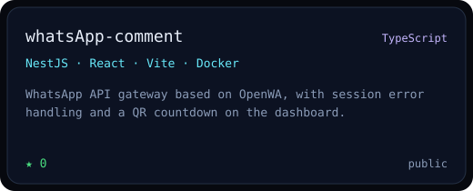</a>
<a href="https://github.com/DriniNazeraj/architectural-vision">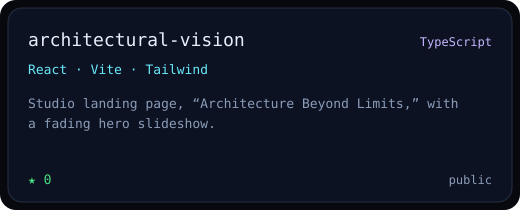</a>

---

Charts, stats, and the header are SVG files in <code>assets/</code>. A GitHub Action redraws them from the public API. The view count comes from Komarev and is cached in the repo, so the badge still renders if that service is down.
